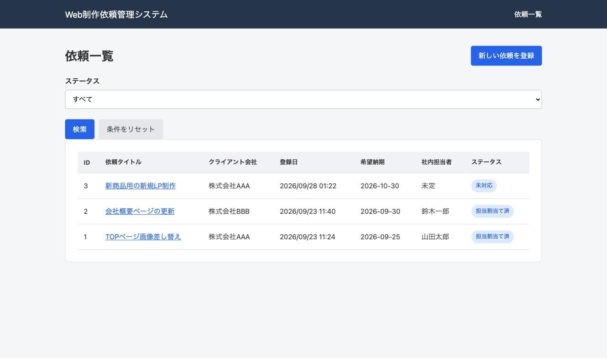
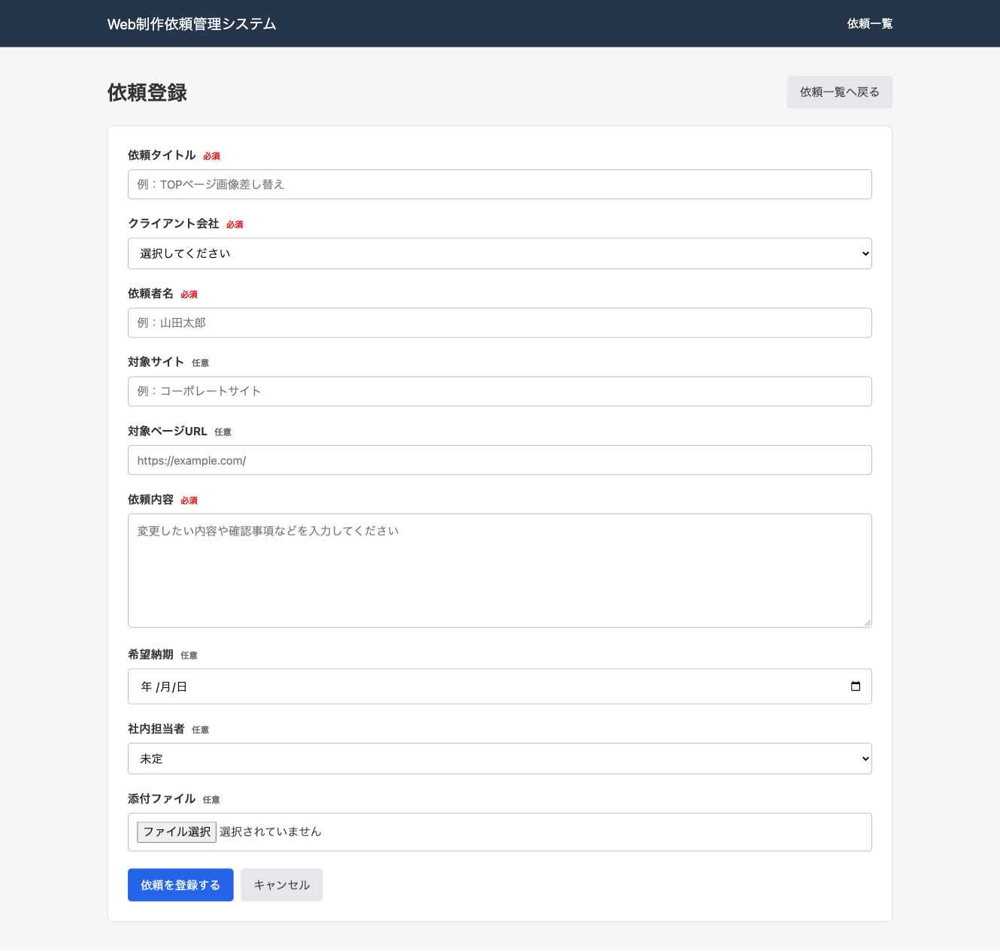
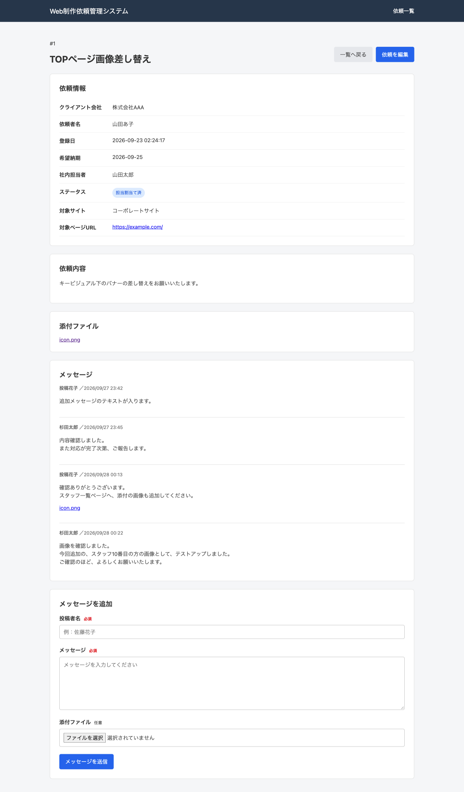
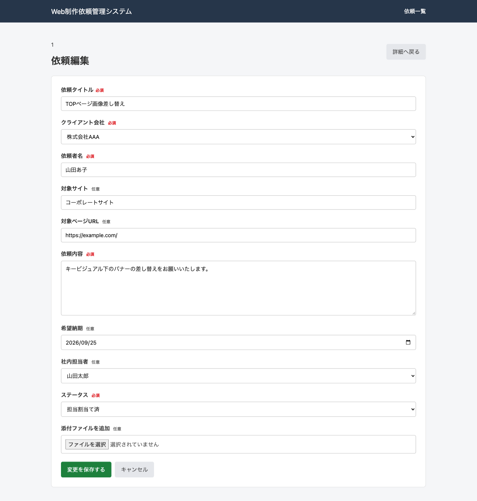
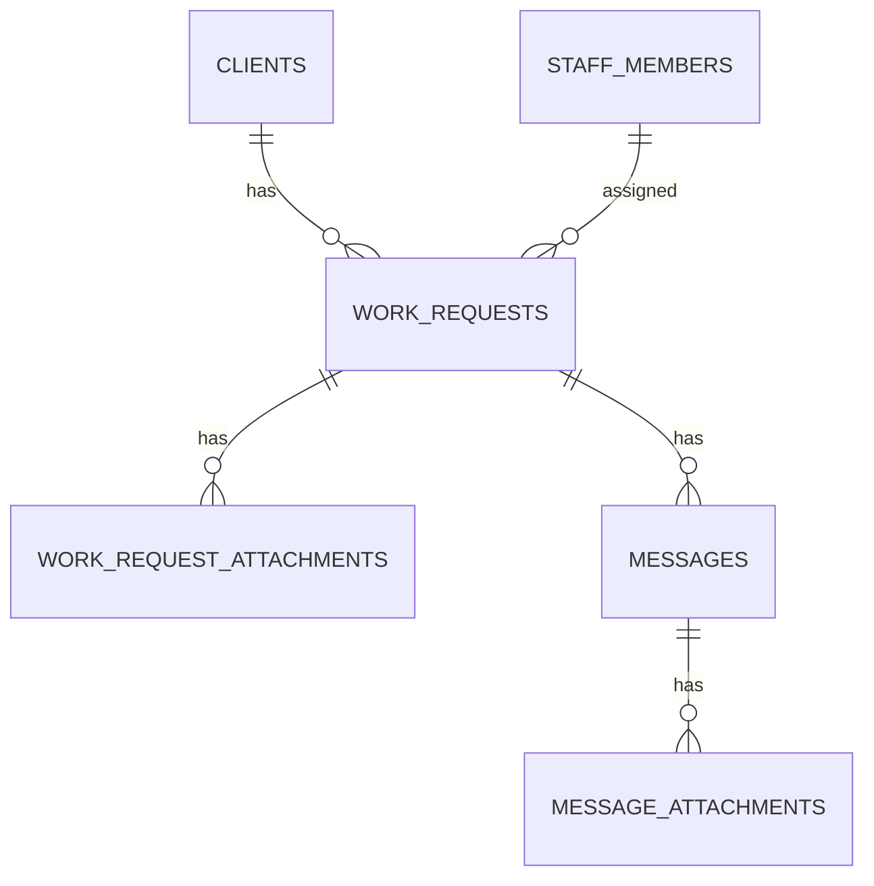

# Web 制作依頼管理システム

Web 制作会社における制作依頼を一元管理するための、社内向け Web アプリケーションです。

メールやチャットに分散しやすい依頼情報をまとめ、担当者・進行状況・メッセージ・添付ファイルを依頼単位で管理できます。

## 制作背景

Web 制作の実務では、修正依頼や確認事項がメール・チャットなど複数の場所に分散し、現在の担当者や進行状況が分かりにくくなることがあります。

そこで、依頼の受付から完了までを一つの画面で確認できるシステムを想定して制作しました。

Laravel の学習だけでなく、実際の業務で使う場合に必要となるデータ構造や操作の流れを意識しています。

## 主な機能

-   制作依頼の登録
-   制作依頼の一覧表示
-   制作依頼の詳細表示
-   制作依頼の編集
-   クライアント会社マスタからの選択
-   社内担当者マスタからの選択
-   ステータス管理
-   キーワード検索
-   ステータスによる絞り込み
-   依頼への添付ファイル登録
-   依頼単位のメッセージ投稿
-   メッセージへの添付ファイル登録
-   入力内容のバリデーション

## 画面

### 依頼一覧



### 依頼登録



### 依頼詳細



### 依頼編集



## ステータス

依頼の進行状況として、以下のステータスを設定できます。

-   未対応
-   依頼内容確認中
-   担当割当て済
-   担当対応中
-   テスト確認依頼中
-   本番反映前
-   完了（本番反映済）
-   保留
-   その他

DB には英語の値を保存し、画面上では日本語に変換して表示しています。

## 使用技術

| 分類           | 技術                  |
| -------------- | --------------------- |
| バックエンド   | PHP 8.5 / Laravel 13  |
| フロントエンド | Blade / HTML / CSS    |
| データベース   | MySQL 8.4             |
| 開発環境       | Docker / Laravel Sail |
| バージョン管理 | Git / GitHub          |

## DB 構成

### clients

クライアント会社のマスタデータを管理します。

### staff_members

社内担当者のマスタデータを管理します。

### work_requests

制作依頼の基本情報、担当者、ステータス、希望納期などを管理します。

### work_request_attachments

制作依頼に添付されたファイルを管理します。

### messages

制作依頼ごとのメッセージを管理します。

### message_attachments

メッセージに添付されたファイルを管理します。

## テーブルの関係



## 工夫した点

### マスタデータの分離

クライアント会社と社内担当者を制作依頼から分離し、プルダウンから選択できる構成にしました。

### ステータス表示

DB には英語のステータス値を保存し、Model で日本語ラベルへ変換しています。

### 依頼単位の情報集約

依頼内容、担当者、ステータス、添付ファイル、メッセージを詳細画面にまとめました。

### 添付ファイルの分離

依頼の添付ファイルとメッセージの添付ファイルを別テーブルで管理し、それぞれ複数のファイルを紐付けられる設計にしました。

### 検索・絞り込み

依頼タイトルによる検索と、ステータスによる絞り込みを実装しました。

## セットアップ

リポジトリを取得します。

```bash
git clone リポジトリのURL
cd revision-manager
```

パッケージをインストールします。

```bash
composer install
```

環境設定ファイルを作成します。

```bash
cp .env.example .env
```

Docker コンテナを起動します。

```bash
./vendor/bin/sail up -d
```

アプリケーションキーを作成します。

```bash
./vendor/bin/sail artisan key:generate
```

テーブルと初期データを作成します。

```bash
./vendor/bin/sail artisan migrate --seed
```

添付ファイル用のリンクを作成します。

```bash
./vendor/bin/sail artisan storage:link
```

CSS と JavaScript をビルドします。

```bash
./vendor/bin/sail npm install
./vendor/bin/sail npm run build
```

ブラウザで以下を開きます。

```text
http://localhost/work_requests
```

## 今後追加したい機能

-   ログイン機能
-   利用者ごとの権限管理
-   添付ファイルの非公開化
-   クライアント会社・社内担当者の管理画面
-   ページネーション
-   テストコード
-   本番環境へのデプロイ

## 制作者

shin693
